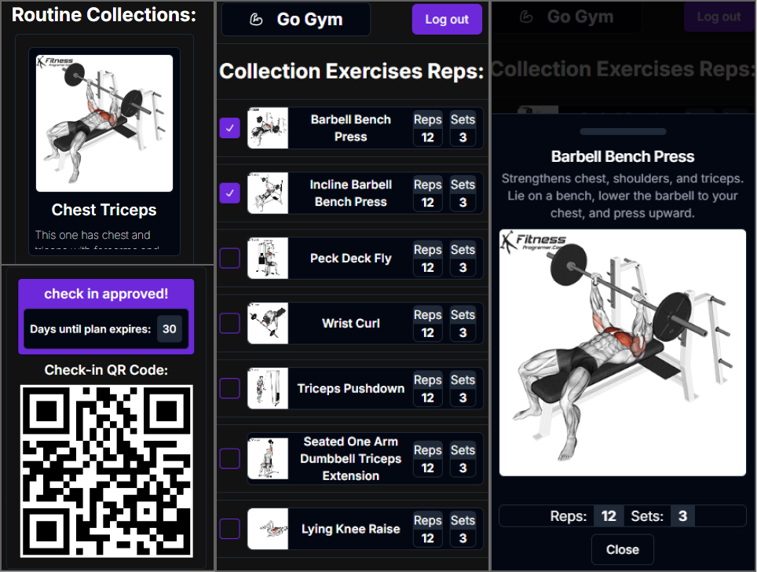
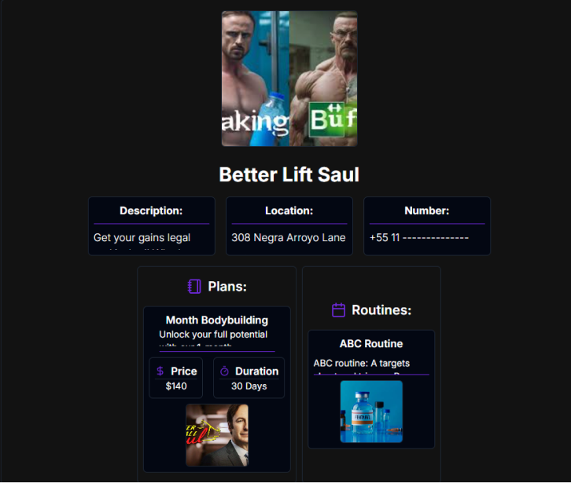
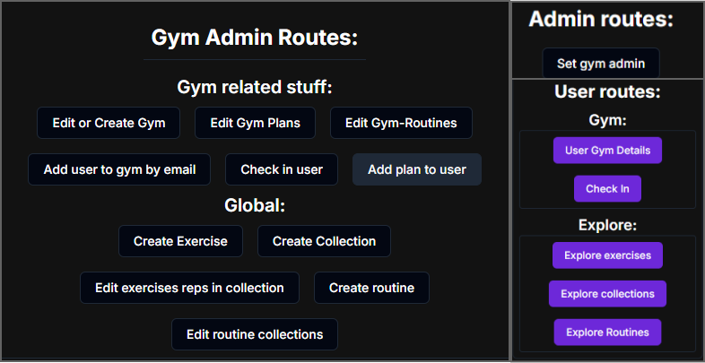

# Go-Gym Frontend

## Overview
Go-Gym is a gym management app where gym admins can create gyms, manage plans, exercises, and routines, while users can check in using QR codes and track their workouts.

## Features
- **Admin Features**:
  - Create gyms, exercises, routines, and plans
  - Manage users and gym routines
  - Scan QR codes to check in users
- **User Features**:
  - Register, log in, and track progress
  - Generate and scan QR codes for check-in

## Tech Stack
- **Next.js** (React framework)
- **Tailwind CSS / Shadcn UI** (styling)
- **React Query** (data fetching)
- **Zod** (validation)
## Screen shots:

## Todo
- [x] catch error in register and send a toast when it occurs
- [x] log in 
- [x] set user gym admin 
- [x] gym admin can create gyms
- [x] 50% done, need to get plans and routines, in /user, GET /user/gym/details
- [x] gym admins can create plans
- [x] admins or gym admins can create exercise
- [X] get exercises
- [x] admins or gym admins can create exercise-reps
- [x] get exercises-reps
- [x] admins or gym admins can create collections
- [x] admins or gym admins can create routines
- [x] get collections
- [x] get routines route
- [x] gym admins can add gym-routines
- [x] gym admins can set user plans
- [x] user can check in generating a qr code
- [x] gym admin can read the qrcode and check in user
- [x] gym admin can also delete and update stuff 
- - [x] update gym
- - [x] delete exercises-reps-collections
- - [x] delete routines-collections 
- - [x] delete plans
- - [x] update plans
- - [x] delete gym routines
- - [ ] delete routines 
- [ ] ui looks like absolute shit and inconsistent [50% done]
- [ ] update exercise (will require backend and db refactor)

